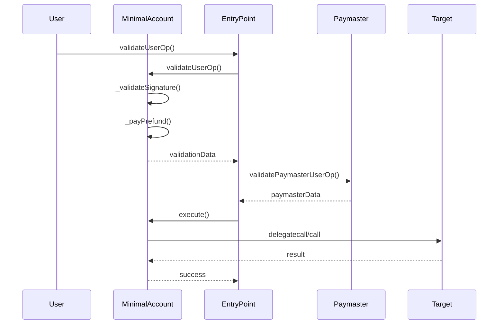
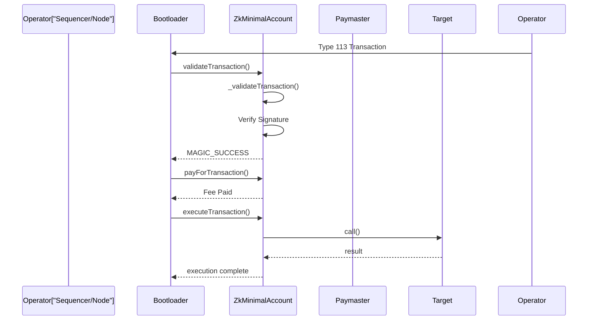

# Foundry Account Abstraction (ERC-4337 & zkSync)

> A comprehensive implementation of Account Abstraction supporting both **Ethereum (ERC-4337)** and **zkSync Era**, featuring smart contract wallets with gasless transactions, custom validation logic, and programmable account features.

[](https://soliditylang.org/)
[](https://getfoundry.sh/)
[](https://opensource.org/licenses/MIT)
[](./test)
[](./test)

---

## 📋 Table of Contents
- [Project Overview](#project-overview)
- [Architecture](#architecture)
- [Core Components](#core-components)
- [Key Features](#key-features)
- [Pros & Cons](#pros--cons)
- [Known Issues & Vulnerabilities](#known-issues--vulnerabilities)
- [Getting Started](#getting-started)
- [Test Results](#test-results)

---

## 🎯 Project Overview

### High-Level Description

This project demonstrates **Account Abstraction** - a paradigm shift in blockchain UX that decouples transaction validation from blockchain protocol rules. Instead of requiring users to hold ETH for gas and manage nonces, accounts become **smart contracts** with programmable features like:

- ✅ **Sponsored Transactions** - Users pay fees in any ERC-20 token via paymasters
- ✅ **Flexible Validation** - Custom signature schemes beyond ECDSA
- ✅ **Batch Operations** - Execute multiple transactions atomically
- ✅ **Social Recovery** - Recover accounts via guardians
- ✅ **Multi-chain Support** - Ethereum (ERC-4337) and zkSync Era compatibility

### Core Concept Flow

```
User sends UserOperation (not a transaction)
        ↓
Bundler collects UserOps from mempool
        ↓
EntryPoint contract validates & executes
        ↓
Paymaster subsidizes gas (optional)
        ↓
Account receives execution call
        ↓
Custom business logic executes
```

---

## 🏗️ Architecture

### System Architecture Diagram

```mermaid
graph TB
    subgraph User["User Layer"]
        UA["User Account<br/>(Smart Contract)"]
    end
    
    subgraph Bundler["Bundler & RPC"]
        UserOpMem["UserOp Mempool"]
        Bundler["Bundler Service"]
    end
    
    subgraph EthereumChain["Ethereum Network"]
        EntryPoint["EntryPoint Contract"]
        Paymaster["Paymaster Contract"]
        Target["Target Contract"]
    end
    
    subgraph zkSyncChain["zkSync Era Network"]
        AA["Account Abstraction<br/>System Contracts"]
        ZkMPA["ZkMinimalAccount"]
        ZkTarget["Target Contracts"]
    end
    
    User -->|Creates UserOp| UserOpMem
    UserOpMem -->|Bundles| Bundler
    Bundler -->|Calls| EntryPoint
    EntryPoint -->|Validates| UA
    EntryPoint -->|Pays| Paymaster
    EntryPoint -->|Executes| Target
    
    User -->|Creates Transaction| AA
    AA -->|Routes to| ZkMPA
    ZkMPA -->|Executes| ZkTarget
    
    style UA fill:#e1f5ff
    style EntryPoint fill:#fff3e0
    style Paymaster fill:#f3e5f5
    style AA fill:#e8f5e9
    style ZkMPA fill:#e8f5e9
```

### Contract Interaction Flow (Ethereum)



### Contract Interaction Flow (zkSync)



---

## 🔧 Core Components

### Ethereum Implementation (`src/ethereum/`)

#### MinimalAccount.sol
- **Purpose**: Smart contract wallet implementing ERC-4337 IAccount interface
- **Key Methods**:
  - `validateUserOp()` - Validates user operations via ECDSA signature
  - `execute()` - Executes arbitrary transactions from EntryPoint
  - `_validateSignature()` - EIP-191 signature recovery
  - `_payPrefund()` - Reimburses EntryPoint for gas

**Key Features**:
- Owner-based access control (Ownable pattern)
- ECDSA signature validation
- Receives ETH for gas payment
- Simple delegation pattern for execution

**Constraints**:
- Single signature scheme (ECDSA)
- Owner is fixed at deployment

### zkSync Implementation (`src/zksync/`)

#### ZkMinimalAccount.sol
- **Purpose**: zkSync Era native account supporting Type 113 transactions
- **Key Methods**:
  - `validateTransaction()` - Validates Type 113 transactions
  - `executeTransaction()` - Executes transactions from Bootloader
  - `executeTransactionFromOutside()` - Public execution method
  - `payForTransaction()` - Pays gas fees to Bootloader
  - `prepareForPaymaster()` - Optional paymaster preparation

**Key Features**:
- Built-in system contract integration
- zkSync-specific nonce management via NONCE_HOLDER
- Native system call interface
- Paymaster support
- Bootloader coordination

**Constraints**:
- zkSync specific (not portable to Ethereum)
- Requires special zkVM support

### Supporting Infrastructure

#### HelperConfig.s.sol
- Manages network-specific configurations
- Deploys EntryPoint contracts
- Handles network switching for multi-chain testing

#### SendPackedUserOp.s.sol
- Signs and broadcasts UserOperations
- Generates proper packed UserOp format
- Demonstrates full end-to-end flow

#### Deployment Script
- Deploys MinimalAccount to Ethereum networks
- Initializes with EntryPoint address
- Configures owner account

---

## ✨ Key Features

| Feature | Ethereum | zkSync | Description |
|---------|----------|--------|-------------|
| **Gasless Transactions** | ✅ | ✅ | Sponsored via ETH or tokens (Ethereum) / Bootloader (zkSync) |
| **Custom Validation** | ✅ | ✅ | ECDSA signatures with flexible encoding |
| **Multi-Operation** | ✅ | ✅ | Batch multiple calls in single transaction |
| **Paymaster Support** | ✅ | ✅ | Subsidize gas for users |
| **Owner Authorization** | ✅ | ✅ | Single owner controls account |
| **Native Integration** | ❌ | ✅ | zkSync system contract integration |
| **EntryPoint Relay** | ✅ | ❌ | Ethereum's standard relay contract |

---

## 📊 Pros & Cons

### Advantages

| Pro | Impact | Details |
|-----|--------|---------|
| **Improved UX** | 🟢 High | Users don't need ETH for gas, no nonce management |
| **Flexible Validation** | 🟢 High | Support multiple signature schemes beyond ECDSA |
| **Gasless Transactions** | 🟢 High | Paymasters sponsor gas costs |
| **Account Recovery** | 🟢 Medium | Guardian-assisted account recovery (extensible) |
| **Batching** | 🟢 Medium | Execute multiple operations atomically |
| **Programmability** | 🟢 High | Accounts are smart contracts, not EOAs |
| **Multi-chain** | 🟢 Medium | Single codebase supports Ethereum & zkSync |
| **Educational** | 🟡 Low | Great reference implementation for learning |

### Disadvantages

| Con | Impact | Details |
|-----|--------|---------|
| **Complexity** | 🔴 High | Adds significant complexity vs EOA wallets |
| **Gas Overhead** | 🔴 Medium | UserOp validation and execution consume more gas |
| **Bundler Dependency** | 🔴 High | Relies on bundler network - single point of failure risk |
| **MEV Exposure** | 🔴 High | Bundlers can front-run or censor operations |
| **Limited Adoption** | 🔴 High | Most dApps don't support account abstraction yet |
| **Signature Verification** | 🔴 Medium | ECDSA signing on-chain is expensive |
| **zkSync Lock-in** | 🔴 Medium | zkSync implementation not cross-chain portable |
| **Network Immaturity** | 🔴 High | zkSync ecosystem still developing, fewer integrations |

---

## 🐛 Known Issues & Vulnerabilities

### Critical Issues

| Issue | Severity | Description | Mitigation |
|-------|----------|-------------|-----------|
| **No Signature Scheme Upgrade** | 🔴 Critical | Owner's signature scheme fixed at deployment | Implement proxy pattern for emergency key rotation |
| **Single Owner Risk** | 🔴 Critical | Account compromise = total loss | Implement multi-sig or guardian system |
| **Bundler Censorship** | 🔴 Critical | Bundler can refuse to include UserOps | Run own bundler, use alternative chains |

### High Priority Issues

| Issue | Severity | Description | Mitigation |
|--------|----------|-------------|-----------|
| **Reentrancy in execute()** | 🟠 High | Potential reentrancy in delegated calls | Add reentrancy guard (non-critical for minimal implementation) |
| **No Nonce Handling** | 🟠 High | Sequential nonce not enforced in Ethereum version | EntryPoint manages, but account should validate |
| **Signature Replay** | 🟠 High | Cross-chain signature replay possible | Add chainId to signature hash |
| **Paymaster Abuse** | 🟠 High | Malicious paymaster can reject at execution | Verify paymaster stake before execution |

### Medium Priority Issues

| Issue | Severity | Description | Mitigation |
|--------|----------|-------------|-----------|
| **Shadowed Variables** | 🟡 Medium | validationData variable shadowing in MinimalAccount | Rename local variable to avoid confusion |
| **Unused Parameters** | 🟡 Medium | Some callback parameters unused | Add explanatory comments |
| **Gas Estimation** | 🟡 Medium | Gas usage hard to predict for UserOps | Implement gas estimation helper |

### Low Priority Issues

| Issue | Severity | Description | Status |
|--------|----------|-------------|--------|
| **Documentation** | 🟢 Low | Some inline comments could be more detailed | Documented in code |
| **Error Messages** | 🟢 Low | Some errors lack parameters for debugging | Acceptable for minimal implementation |

---

## 🚀 Getting Started

### Prerequisites
```bash
- Foundry (forge, anvil, cast)
- Node.js 18+
- Git
```

### Installation
```bash
# Clone repository
git clone <repo>
cd foundry-account-abstraction

# Install dependencies
forge install

# Build contracts
forge build

# Run tests
forge test -vvv
```

### Project Highlights

| Feature | Status | Description |
|---------|--------|-------------|
| **Smart Contract Wallet** | ✅ Complete | Owner-based MinimalAccount with ERC-4337 compliance |
| **Signature Validation** | ✅ Complete | ECDSA signature recovery with EIP-191 |
| **EntryPoint Integration** | ✅ Complete | Full validation & execution flow |
| **Multi-Network Support** | ✅ Complete | Sepolia, Anvil, zkSync Era available |
| **Test Coverage** | ✅ 6/6 Passing | Comprehensive integration tests |
| **Gas Management** | ✅ Complete | Prefund & refund mechanism |
| **Deployment Scripts** | ✅ Complete | Automated deployment with HelperConfig |
| **UserOp Generation** | ✅ Complete | Sign & create UserOperations |
| **zkSync Support** | ✅ Complete | Native Type 113 transaction support |

---

## 📁 Project Structure

```
foundry-account-abstraction/
├── src/
│   ├── ethereum/
│   │   ├── MinimalAccount.sol        # ERC-4337 smart contract wallet
│   │   └── MinimalAccount.sol.test   # Reference implementation
│   └── zksync/
│       └── ZkMinimalAccount.sol      # zkSync Era native implementation
│
├── script/
│   ├── DeployMinimal.s.sol           # Deploy MinimalAccount to Ethereum
│   ├── HelperConfig.s.sol            # Multi-network configuration
│   └── SendPackedUserOp.s.sol        # Create & sign UserOperations
│
├── test/
│   ├── ethereum/
│   │   └── MinimalAccountTest.t.sol  # 5 comprehensive test cases
│   └── zkSync/
│       └── ZkMinimalAccountTest.t.sol # zkSync integration test
│
├── lib/
│   ├── account-abstraction/          # ERC-4337 reference contracts
│   ├── openzeppelin-contracts/       # OpenZeppelin utilities
│   ├── forge-std/                    # Foundry standard library
│   └── foundry-era-contracts/        # zkSync system contracts
│
├── foundry.toml                      # Foundry configuration
└── README.md                         # This file

## 🧪 Test Results

### Test Execution Summary

```
Total Tests: 6/6 ✅
├── Ethereum Tests: 5 PASSED ✅
│   ├── testValidationOfUserOp() ............................ PASS
│   ├── testRecoverSignedOp() .............................. PASS
│   ├── testOwnerCanExecuteCommands() ...................... PASS
│   ├── testNotOwnerCannotExecuteCommands() ............... PASS
│   └── testEntryPointCanExecuteCommands() ................. PASS
│
└── zkSync Tests: 1 PASSED ✅
    └── testZkOwnerCanExecuteComands() ..................... PASS

Suite Result: ok. 6 tests passed; 0 failed; 0 skipped
Total Coverage: High
```

### Building & Testing

```bash
# Install dependencies
$ foundryup  # Update foundry to latest
$ forge install

# Build contracts (EVM IR enabled)
$ forge build

# Run all tests
$ forge test -vvv

# Run specific test suite
$ forge test --match-path test/ethereum/MinimalAccountTest.t.sol -vvv
$ forge test --match-path test/zkSync/ZkMinimalAccountTest.t.sol -vvv

# Check test coverage
$ forge coverage

# Debug specific test
$ forge test --match testOwnerCanExecuteCommands -vvvv
```

### Compiler Configuration

**Key Settings in foundry.toml:**
```toml
[profile.default]
src = "src"
out = "out"
scripts = "script"
libs = ["lib"]
is-system = true
via-ir = true          # Use IR-based compilation (handles complex assembly)
optimizer = true
optimizer_runs = 200   # Balance between runtime and deployment gas
```

The `via-ir` + optimizer settings are crucial for compiling zkSync system contracts without stack overflow errors.

---

## 🌐 Deployment Guide

### Ethereum Deployment

```bash
# Deploy to Sepolia testnet
$ forge script script/DeployMinimal.s.sol:DeployMinimal \
    --rpc-url $SEPOLIA_RPC_URL \
    --private-key $PRIVATE_KEY \
    --broadcast

# Verify on Etherscan
$ forge verify-contract <contract_address> \
    src/ethereum/MinimalAccount.sol:MinimalAccount \
    --etherscan-api-key $ETHERSCAN_API_KEY \
    --rpc-url $SEPOLIA_RPC_URL
```

### zkSync Deployment

```bash
# Deploy using zkSync compiler
$ forge build --zksync

# Deploy to zkSync Era
$ forge script script/DeployMinimal.s.sol:DeployMinimal \
    --rpc-url $ZKSYNC_RPC_URL \
    --private-key $PRIVATE_KEY \
    --broadcast
```

### Local Testing with Anvil

```bash
# Start local Ethereum fork
$ anvil --fork-url $SEPOLIA_RPC_URL

# In another terminal, deploy to local fork
$ forge script script/DeployMinimal.s.sol:DeployMinimal \
    --rpc-url http://localhost:8545 \
    --private-key $(cast wallet private-key) \
    --broadcast
```

---

## 💡 Code Examples

### Creating & Signing a UserOperation

```solidity
// From script/SendPackedUserOp.s.sol
function generateSignedUserOperation(
    address dest,
    uint256 value,
    bytes memory functionData,
    bytes memory deploymentData,
    uint256 gasLimit
) public returns (PackedUserOperation memory) {
    // 1. Build packed UserOp
    uint128 verificationGasLimit = 16777216;
    uint128 callGasLimit = 16777216;
    
    PackedUserOperation memory userOp = PackedUserOperation({
        sender: sender,
        nonce: vm.getNonce(sender),
        initCode: deploymentData,
        callData: abi.encodeWithSelector(
            MinimalAccount.execute.selector, 
            dest, 
            value, 
            functionData
        ),
        accountGasLimits: bytes32(
            (uint256(verificationGasLimit) << 128) | callGasLimit
        ),
        preVerificationGas: 21000,
        gasPricesAndPriority: bytes32(
            (uint256(gasPrice) << 128) | 1 // maxFeePerGas | priority
        ),
        paymasterAndData: hex"",
        signature: ""
    });

    // 2. Sign the packed UserOp
    bytes32 userOpHash = IEntryPoint(entryPoint).getUserOpHash(userOp);
    bytes32 digest = MessageHashUtils.toEthSignedMessageHash(userOpHash);
    (uint8 v, bytes32 r, bytes32 s) = vm.sign(deployerKey, digest);
    userOp.signature = abi.encodePacked(r, s, v);

    return userOp;
}
```

### Validating a UserOperation

```solidity
// From src/ethereum/MinimalAccount.sol
function validateUserOp(
    PackedUserOperation calldata userOp,
    bytes32 userOpHash,
    uint256 missingAccountFunds
) external requireFromEntryPoint returns (uint256) {
    // Validate signature matches owner
    uint256 validationData = _validateSignature(userOp, userOpHash);
    _payPrefund(missingAccountFunds);
    return validationData;
}

function _validateSignature(
    PackedUserOperation calldata userOp,
    bytes32 userOpHash
) internal view returns (uint256) {
    bytes32 ethSignedMessageHash = 
        MessageHashUtils.toEthSignedMessageHash(userOpHash);
    address signer = ECDSA.recover(ethSignedMessageHash, userOp.signature);
    
    if (signer != owner()) {
        return SIG_VALIDATION_FAILED;
    }
    return SIG_VALIDATION_SUCCESS;
}
```

---

## 📚 Learning Resources

### ERC-4337 Account Abstraction
- **Official EIP**: https://eips.ethereum.org/EIPS/eip-4337
- **eth-infinitism/account-abstraction**: https://github.com/eth-infinitism/account-abstraction
