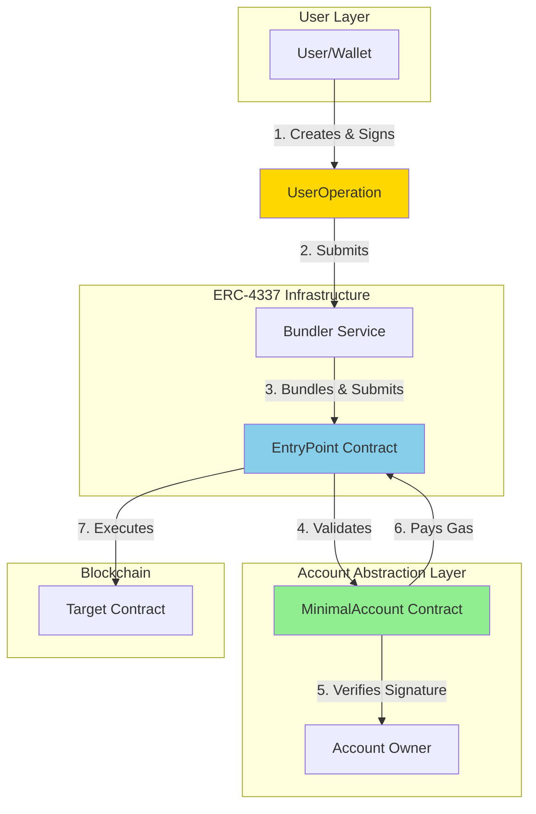
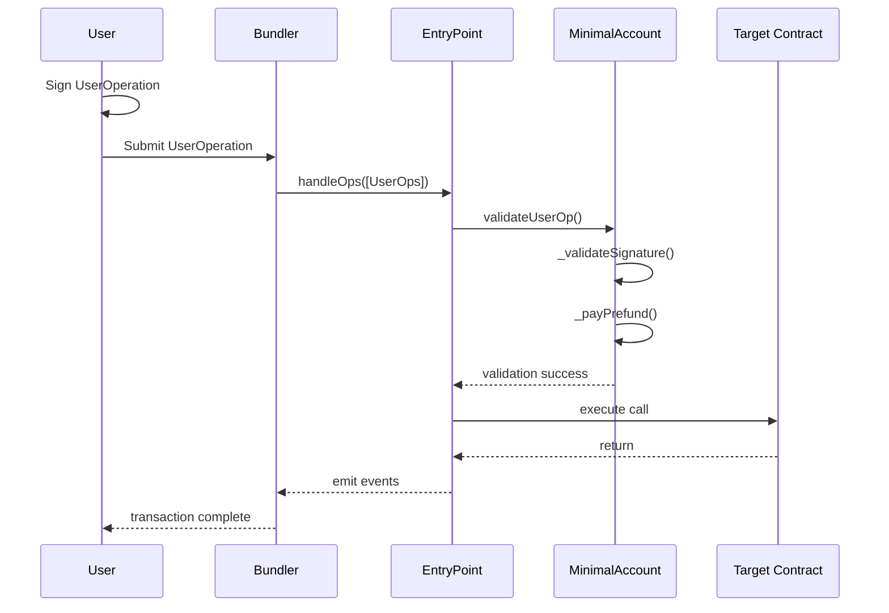
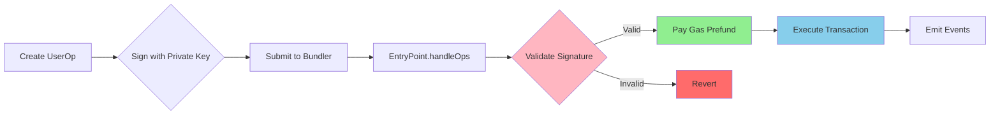

# Foundry Account Abstraction

A minimal implementation of ERC-4337 Account Abstraction using Foundry, demonstrating smart contract wallets that enable gasless transactions and custom validation logic.

## Table of Contents
- [Overview](#overview)
- [Project Architecture](#project-architecture)
- [Core Components](#core-components)
- [System Flow](#system-flow)
- [Pros & Cons](#pros--cons)
- [Known Issues](#known-issues)
- [Setup & Usage](#setup--usage)

## Overview

This project implements **Account Abstraction (ERC-4337)** - a standard that allows users to use smart contract wallets instead of Externally Owned Accounts (EOAs). This enables advanced features like:

- **Gasless Transactions**: Third parties can sponsor gas fees
- **Batch Operations**: Execute multiple transactions atomically
- **Custom Validation Logic**: Implement alternative signature schemes
- **Social Recovery**: Add multi-sig or guardian-based recovery
- **Session Keys**: Temporary permissions for dApps

### What is Account Abstraction?

Traditional Ethereum accounts (EOAs) are limited to basic ECDSA signatures and require ETH for gas. Account Abstraction moves account logic into smart contracts, enabling programmable wallets with custom rules.

## Project Architecture



## Core Components

### MinimalAccount Contract

The core smart contract wallet implementing the IAccount interface.

**Key Features:**
- ✅ Signature validation (ECDSA with EIP-191)
- ✅ EntryPoint integration
- ✅ Gas prefunding mechanism
- ✅ Owner-based access control

**Main Functions:**

```solidity
function validateUserOp(
    PackedUserOperation calldata userOp,
    bytes32 userOpHash,
    uint256 missingAccountFunds
) external requireFromEntryPoint returns (uint256)
```



### UserOperation Flow

1. **User** creates and signs a UserOperation containing:
   - Sender (account address)
   - Nonce
   - Call data
   - Gas limits
   - Signature

2. **Bundler** collects multiple UserOperations and submits them to EntryPoint

3. **EntryPoint** validates each operation by calling `validateUserOp()` on the account

4. **MinimalAccount** verifies the signature and prefunds gas

5. **EntryPoint** executes the transaction if validation succeeds

## System Flow



## Pros & Cons

| **Pros** ✅ | **Cons** ❌ |
|------------|------------|
| **Gasless Transactions**: Enable gas sponsorship via paymasters | **Complexity**: More complex than traditional EOA transactions |
| **Batch Operations**: Execute multiple calls atomically | **Gas Overhead**: Extra validation adds gas costs (~42k gas) |
| **Flexible Validation**: Support custom signature schemes (multisig, passkeys) | **Adoption**: Limited infrastructure support (bundlers, tools) |
| **Security Features**: Add spending limits, whitelists, time locks | **User Experience**: Requires understanding of UserOperations |
| **Social Recovery**: Implement guardian-based recovery mechanisms | **Centralization Risk**: Depends on bundler network availability |
| **Session Keys**: Temporary permissions for dApps | **Immutability**: Cannot upgrade logic without proxy patterns |
| **No Private Key Exposure**: Keep keys in hardware wallets | **Testing Complexity**: Harder to test than simple EOA flows |

## Known Issues

| **Issue** | **Severity** | **Description** | **Mitigation** |
|-----------|--------------|-----------------|----------------|
| Missing Return Value | ⚠️ Medium | `validateUserOp()` declares return but doesn't return `validationData` | Add explicit return statement |
| Unused Success Variable | ⚠️ Low | Line 56: `(success)` statement does nothing | Use `require(success)` or remove |
| No Execute Function | ⚠️ Medium | Cannot execute arbitrary calls - account is validation-only | Implement `execute()` and `executeBatch()` functions |
| No Receive/Fallback | 🔵 Info | Cannot receive ETH directly | Add `receive()` external payable {} |
| Single Owner Risk | ⚠️ Medium | Loss of private key = permanent loss of account | Implement multi-sig or social recovery |
| No Upgradability | 🔵 Info | Logic cannot be changed after deployment | Use UUPS or Transparent proxy pattern |
| Gas Limit Risk | ⚠️ Low | `type(uint256).max` gas limit could be dangerous | Use reasonable gas limit |

## Setup & Usage

### Prerequisites

- [Foundry](https://book.getfoundry.sh/getting-started/installation.html)
- [Git](https://git-scm.com/downloads)

### Installation

```shell
# Clone the repository
git clone <repository-url>
cd foundry-account-abstraction

# Install dependencies
forge install
```

### Build

```shell
forge build
```

### Test

```shell
forge test
forge test -vvv  # verbose output
```

### Format Code

```shell
forge fmt
```

### Gas Snapshots

```shell
forge snapshot
```

### Deploy

```shell
forge script script/DeployMinimalAccount.s.sol --rpc-url <RPC_URL> --private-key <PRIVATE_KEY> --broadcast
```

### Local Development

```shell
# Start local node
anvil

# Deploy to local node (in another terminal)
forge script script/DeployMinimalAccount.s.sol --rpc-url http://localhost:8545 --private-key <ANVIL_PRIVATE_KEY> --broadcast
```

## Resources

### Foundry Documentation
- [Foundry Book](https://book.getfoundry.sh/)
- [Forge](https://book.getfoundry.sh/forge/) - Testing framework
- [Cast](https://book.getfoundry.sh/cast/) - CLI for EVM interaction
- [Anvil](https://book.getfoundry.sh/anvil/) - Local Ethereum node

### Account Abstraction (ERC-4337)
- [ERC-4337 Specification](https://eips.ethereum.org/EIPS/eip-4337)
- [Account Abstraction Documentation](https://docs.alchemy.com/docs/account-abstraction-overview)
- [eth-infinitism Repository](https://github.com/eth-infinitism/account-abstraction)

### Related Standards
- [EIP-191: Signed Data Standard](https://eips.ethereum.org/EIPS/eip-191)
- [OpenZeppelin Contracts](https://docs.openzeppelin.com/contracts/)

---

**Last Updated**: February 2026 | Built with ❤️ using Foundry
