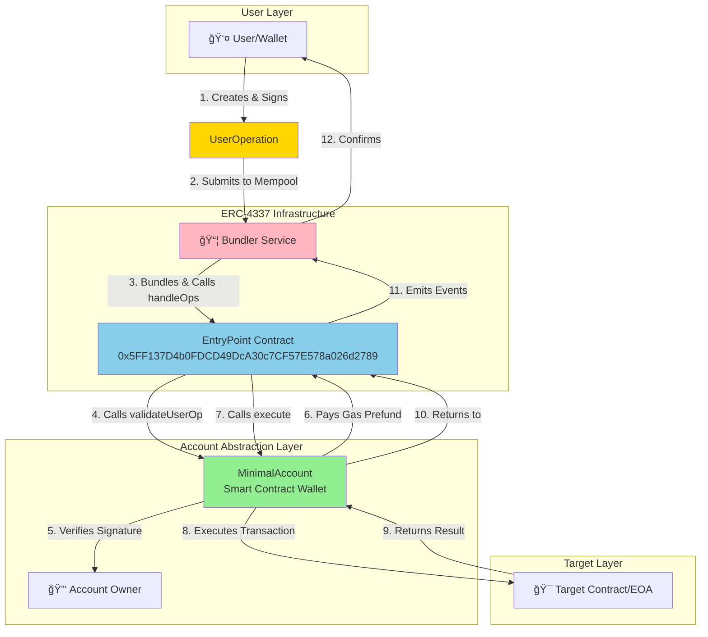

# Foundry Account Abstraction (ERC-4337)

> A minimal implementation of ERC-4337 Account Abstraction using Foundry, demonstrating smart contract wallets with gasless transactions, custom validation logic, and programmable account features.

[](https://soliditylang.org/)
[](https://getfoundry.sh/)
[](https://opensource.org/licenses/MIT)

## Table of Contents
- [Overview](#overview)
- [Project Structure](#project-structure)
- [Architecture](#architecture)
- [Core Components](#core-components)
- [System Flow](#system-flow)
- [Deployment](#deployment)
- [Pros & Cons](#pros--cons)
- [Known Issues](#known-issues)
- [Setup & Usage](#setup--usage)
- [Resources](#resources)

## Overview

This project implements **ERC-4337 Account Abstraction** - a paradigm shift from Externally Owned Accounts (EOAs) to smart contract wallets, unlocking programmable account capabilities on Ethereum and EVM-compatible chains.

### 🎯 What is Account Abstraction?

Traditional Ethereum accounts (EOAs) have fundamental limitations:
- ❌ Require ETH for gas fees
- ❌ Single signature validation (ECDSA only)
- ❌ No programmability
- ❌ Cannot batch operations
- ❌ No native recovery mechanisms

**Account Abstraction solves these problems** by moving account logic into smart contracts:

✅ **Gasless Transactions** - Paymasters can sponsor gas fees  
✅ **Flexible Signatures** - Support multi-sig, passkeys, biometrics  
✅ **Batch Operations** - Execute multiple calls atomically  
✅ **Social Recovery** - Guardian-based account recovery  
✅ **Session Keys** - Temporary permissions for dApps  
✅ **Spending Limits** - Built-in security policies  

### 🏗️ Project Goals

This educational project demonstrates:
1. Minimal ERC-4337 Account implementation
2. Integration with EntryPoint contract
3. Signature validation using EIP-191
4. Gas prefunding mechanism
5. Multi-network deployment (Ethereum, zkSync)

## Project Structure

```
foundry-account-abstraction/
├── src/
│   └── ethereum/
│       └── MinimalAccount.sol        # Main account abstraction contract
├── script/
│   ├── DeployMinimal.s.sol          # Deployment script
│   ├── HelperConfig.s.sol           # Network configuration helper
│   └── SendPackedUserOp.s.sol       # UserOperation sender script
├── test/
│   ├── MinimalAccountTest.t.sol             # Unit tests for MinimalAccount
│   ├── MinimalAccountIntegrationTest.t.sol  # Integration tests with EntryPoint
│   ├── SecurityVulnerabilityTest.t.sol      # Security vulnerability tests
│   ├── HelperConfigTest.t.sol               # HelperConfig script tests
│   ├── DeployMinimalTest.t.sol              # Deployment script tests
│   └── InvariantAndEdgeCaseTest.t.sol       # Invariant and edge case tests
├── lib/
│   ├── account-abstraction/         # ERC-4337 reference implementation
│   ├── forge-std/                   # Foundry standard library
│   └── openzeppelin-contracts/      # OpenZeppelin contracts
└── foundry.toml                     # Foundry configuration
```

### Key Files

| File | Purpose |
|------|---------|
| [MinimalAccount.sol](src/ethereum/MinimalAccount.sol) | Core smart contract wallet implementing IAccount interface |
| [DeployMinimal.s.sol](script/DeployMinimal.s.sol) | Foundry deployment script for MinimalAccount |
| [HelperConfig.s.sol](script/HelperConfig.s.sol) | Multi-network configuration (Sepolia, zkSync, Anvil) |
| [SendPackedUserOp.s.sol](script/SendPackedUserOp.s.sol) | Script to send UserOperations to bundlers |

## Architecture

### High-Level System Diagram



### Detailed Validation Flow


## Core Components

### 1. MinimalAccount Contract

The heart of the project - a smart contract wallet implementing the `IAccount` interface from ERC-4337.

**📝 Contract Details:**
- **Location**: [src/ethereum/MinimalAccount.sol](src/ethereum/MinimalAccount.sol)
- **Inherits**: `IAccount`, `Ownable`
- **Key Dependencies**: OpenZeppelin (ECDSA, MessageHashUtils), ERC-4337 interfaces

**🔧 State Variables:**
```solidity
IEntryPoint private immutable i_entryPoint;  // EntryPoint contract address
```

**⚡ Core Functions:**

#### `validateUserOp()`
Validates UserOperation signature and pays gas prefund.

```solidity
function validateUserOp(
    PackedUserOperation calldata userOp,
    bytes32 userOpHash,
    uint256 missingAccountFunds
) external requireFromEntryPoint returns (uint256 validationData)
```

**Process:**
1. Validates signature using `_validateSignature()`
2. Pays missing gas funds using `_payPrefund()`
3. Returns validation status (0 = success, 1 = failure)

#### `execute()`
Executes arbitrary calls to target contracts.

```solidity
function execute(
    address destination,
    uint256 value,
    bytes calldata functionData
) external requireFromEntryPointOwner
```

**Features:**
- Can only be called by EntryPoint or Owner
- Executes low-level call to destination
- Reverts with call data on failure

#### `_validateSignature()`
Internal function using EIP-191 signed message hash.

```solidity
function _validateSignature(
    PackedUserOperation calldata userOp,
    bytes32 userOpHash
) internal view returns (uint256 validationData)
```

**Validation Steps:**
1. Convert `userOpHash` to EIP-191 format: `"\x19Ethereum Signed Message:\n32" + hash`
2. Recover signer address using ECDSA
3. Compare with account owner
4. Return `SIG_VALIDATION_SUCCESS` (0) or `SIG_VALIDATION_FAILED` (1)

#### `_payPrefund()`
Pays EntryPoint for gas consumed during validation.

```solidity
function _payPrefund(uint256 missingAccountFunds) internal
```

**Security Modifiers:**

| Modifier | Protection |
|----------|------------|
| `requireFromEntryPoint` | Only EntryPoint can call |
| `requireFromEntryPointOwner` | Only EntryPoint OR Owner can call |

**🛡️ Error Handling:**

```solidity
error MinimalAccount__NotFromEntryPoint();
error MinimalAccount__NotFromEntryPointOrOwner();
error MinimalAccount__CallFailed(bytes);
```

### 2. HelperConfig Contract

Multi-network configuration management for deployments.

**📍 Supported Networks:**

| Network | Chain ID | EntryPoint Address |
|---------|----------|-------------------|
| Ethereum Sepolia | 11155111 | `0x5FF137D4b0FDCD49DcA30c7CF57E578a026d2789` |
| zkSync Sepolia | 300 | `address(0)` (not supported) |
| Local Anvil | 31337 | Deployed locally |

**🔑 Configuration Structure:**
```solidity
struct NetworkConfig {
    address entryPoint;  // EntryPoint contract address
    address account;     // Deployer/burner wallet
}
```

### 3. DeployMinimal Script

Foundry deployment script for MinimalAccount.

**Deployment Process:**
1. Load network configuration from HelperConfig
2. Get EntryPoint address for current chain
3. Deploy MinimalAccount with EntryPoint reference
4. Transfer ownership to deployer

```solidity
function deployMinimalAccount() public returns (HelperConfig, MinimalAccount) {
    HelperConfig helperConfig = new HelperConfig();
    NetworkConfig memory config = helperConfig.getConfig();
    
    vm.startBroadcast(config.account);
    MinimalAccount account = new MinimalAccount(config.entryPoint);
    vm.stopBroadcast();
    
    return (helperConfig, account);
}
```

### 4. UserOperation Structure

The atomic unit of Account Abstraction (from ERC-4337):

```solidity
struct PackedUserOperation {
    address sender;              // Smart contract wallet address
    uint256 nonce;              // Anti-replay protection
    bytes initCode;             // Factory + factory data (for account creation)
    bytes callData;             // execute() call data
    bytes32 accountGasLimits;   // Validation & call gas limits (packed)
    uint256 preVerificationGas; // Extra gas for bundler
    bytes32 gasFees;            // maxFeePerGas + maxPriorityFeePerGas (packed)
    bytes paymasterAndData;     // Paymaster address + data
    bytes signature;            // Owner's signature
}
```

**UserOperation Lifecycle:**


## Deployment

### Network Support

This project supports deployment to:

- ✅ **Ethereum Sepolia** (Testnet) - EntryPoint: `0x5FF137D4b0FDCD49DcA30c7CF57E578a026d2789`
- ✅ **Local Anvil** (Development) - EntryPoint deployed locally
- ⚠️ **zkSync Sepolia** (Partial support) - Native AA, different architecture

### Deployment Steps


## Pros & Cons

### Advantages ✅

| **Feature** | **Benefit** | **Use Case** |
|-------------|-------------|--------------|
| **Gasless Transactions** | Users don't need ETH for gas | Onboarding new users, dApp UX |
| **Batch Operations** | Execute multiple calls atomically | DeFi strategies, bulk transfers |
| **Flexible Signatures** | Support multi-sig, passkeys, biometrics | Enhanced security models |
| **Social Recovery** | Guardian-based account recovery | Lost key scenarios |
| **Session Keys** | Temporary permissions without full control | Gaming, automated trading |
| **Spending Limits** | Built-in financial controls | Risk management |
| **Custom Validation** | Programmable authentication logic | Enterprise requirements |
| **Paymaster Support** | Third-party gas sponsorship | Protocol subsidized transactions |

### Disadvantages ❌

| **Challenge** | **Impact** | **Mitigation** |
|---------------|------------|----------------|
| **Increased Gas Costs** | ~42k extra gas per transaction | Use batch operations to amortize |
| **Complexity** | Harder to understand than EOA | Better documentation, tooling |
| **Infrastructure Dependency** | Relies on bundler network | Run own bundler, use reliable services |
| **Limited Adoption** | Not all dApps support AA | Growing ecosystem support |
| **Testing Difficulty** | Complex integration tests needed | Use simulation tools |
| **Immutability Issues** | Cannot upgrade without proxy | Deploy with UUPS/Transparent proxy |
| **MEV Concerns** | Bundlers can reorder operations | Use private bundlers, flashbots |

## Known Issues

| **Issue** | **Severity** | **Location** | **Description** | **Fix Required** |
|-----------|--------------|--------------|-----------------|------------------|
| **Unused Success Variable** | 🟡 Low | [MinimalAccount.sol#L83](src/ethereum/MinimalAccount.sol#L83) | `(success)` statement does nothing | Use `require(success)` or remove statement |
| **Unlimited Gas Allowance** | 🟠 Medium | [MinimalAccount.sol#L83](src/ethereum/MinimalAccount.sol#L83) | `type(uint256).max` gas could be exploited | Use reasonable gas limit (e.g., `gasleft()`) |
| **No Batch Execute** | 🟡 Low | Contract lacks batch function | Cannot execute multiple calls in one UserOp efficiently | Implement `executeBatch(address[], uint256[], bytes[])` |
| **No Signature Aggregation** | 🔵 Info | Not implemented | Cannot use signature aggregators | Implement aggregator support if needed |
| **Missing Events** | 🟡 Low | No event emissions | Difficult to track contract activities | Add events for execute, receive ETH |
| **Single Owner Risk** | 🟠 Medium | Ownable pattern | Loss of key = permanent loss | Add multi-sig or recovery module |
| **No Upgradability** | 🔵 Info | Not upgradeable | Cannot fix bugs or add features | Deploy with proxy pattern |
| **HelperConfig Incomplete** | 🟠 Medium | [HelperConfig.s.sol#L49-53](script/HelperConfig.s.sol#L49) | `getOrCreateAnvilEthConfig()` returns empty config | Add missing implementation |

### Security Considerations

⚠️ **Critical Security Notes:**

1. **Private Key Management**: Owner private key has full control - use hardware wallet
2. **EntryPoint Trust**: Immutable reference to EntryPoint - verify address before deployment
3. **Gas Prefund**: Account must have enough ETH to pay gas prefund
4. **Signature Replay**: Nonce prevents replay attacks - do not reuse signatures
5. **Call Execution**: `execute()` can call any address - verify calldata carefully

### Testing Status

| Component | Unit Tests | Integration Tests | Gas Optimization | Status |
|-----------|------------|-------------------|------------------|--------|
| MinimalAccount | ✅ Implemented | ✅ Implemented | ⚠️ Not measured | 🟢 **Comprehensive** |
| DeployMinimal | ✅ Implemented | ✅ Implemented | N/A | 🟢 **Complete** |
| HelperConfig | ✅ Implemented | ✅ Implemented | N/A | 🟢 **Complete** |

### Test Coverage

The following test files have been added:

| Test File | Description | Test Count |
|-----------|-------------|------------|
| [MinimalAccountTest.t.sol](test/MinimalAccountTest.t.sol) | Unit tests for MinimalAccount core functionality | 30+ tests |
| [MinimalAccountIntegrationTest.t.sol](test/MinimalAccountIntegrationTest.t.sol) | Full ERC-4337 flow integration tests | 15+ tests |
| [SecurityVulnerabilityTest.t.sol](test/SecurityVulnerabilityTest.t.sol) | Security-focused vulnerability tests | 20+ tests |
| [HelperConfigTest.t.sol](test/HelperConfigTest.t.sol) | HelperConfig script tests | 10+ tests |
| [DeployMinimalTest.t.sol](test/DeployMinimalTest.t.sol) | Deployment script tests | 5+ tests |
| [InvariantAndEdgeCaseTest.t.sol](test/InvariantAndEdgeCaseTest.t.sol) | Invariant and edge case tests | 15+ tests |

**Categories Covered:**
- ✅ Access Control Vulnerabilities
- ✅ Signature Validation & Malleability
- ✅ Reentrancy Attacks
- ✅ Gas Griefing & DoS
- ✅ Flash Loan Attacks
- ✅ Cross-Chain Replay
- ✅ Integer Overflow/Underflow
- ✅ Ownership Security
- ✅ Edge Cases & Fuzzing
- ✅ Invariant Testing

## Setup & Usage

### Prerequisites

Ensure you have the following installed:

- **Foundry** - [Installation Guide](https://book.getfoundry.sh/getting-started/installation.html)
  ```bash
  curl -L https://foundry.paradigm.xyz | bash
  foundryup
  ```
- **Git** - [Download](https://git-scm.com/downloads)
- **Node.js** (optional, for bundler interaction) - [Download](https://nodejs.org/)

### Installation

```bash
# Clone the repository
git clone <repository-url>
cd foundry-account-abstraction

# Install dependencies (Forge submodules)
forge install

# Build the project
forge build
```

### Build & Compile

```bash
# Compile contracts
forge build

# Compile with size optimization
forge build --optimize --optimizer-runs 200

# Clean build artifacts
forge clean
```

### Testing

```bash
# Run all tests (when implemented)
forge test

# Run tests with verbosity
forge test -vv      # Show test results
forge test -vvv     # Show stack traces
forge test -vvvv    # Show setup traces
forge test -vvvvv   # Show execution traces

# Run specific test file
forge test --match-path test/MinimalAccount.t.sol

# Run specific test function
forge test --match-test testValidateUserOp

# Generate gas report
forge test --gas-report

# Run tests with coverage
forge coverage
```

### Deployment

#### Local Deployment (Anvil)

```bash
# Terminal 1: Start local node
anvil

# Terminal 2: Deploy to local network
forge script script/DeployMinimal.s.sol:DeployMinimal \
    --rpc-url http://localhost:8545 \
    --private-key <ANVIL_PRIVATE_KEY> \
    --broadcast

# Use default Anvil key (for testing only!)
forge script script/DeployMinimal.s.sol:DeployMinimal \
    --rpc-url http://localhost:8545 \
    --private-key 0xac0974bec39a17e36ba4a6b4d238ff944bacb478cbed5efcae784d7bf4f2ff80 \
    --broadcast -vvvv
```

#### Sepolia Testnet Deployment

```bash
# Set environment variables
export SEPOLIA_RPC_URL="https://eth-sepolia.g.alchemy.com/v2/YOUR_KEY"
export PRIVATE_KEY="your_private_key_here"

# Deploy to Sepolia
forge script script/DeployMinimal.s.sol:DeployMinimal \
    --rpc-url $SEPOLIA_RPC_URL \
    --private-key $PRIVATE_KEY \
    --broadcast \
    --verify \
    --etherscan-api-key $ETHERSCAN_API_KEY

# Or use .env file
source .env
forge script script/DeployMinimal.s.sol:DeployMinimal \
    --rpc-url $SEPOLIA_RPC_URL \
    --broadcast --verify
```

### Interacting with Cast

```bash
# Check account balance
cast balance <MINIMAL_ACCOUNT_ADDRESS> --rpc-url $RPC_URL

# Get EntryPoint address
cast call <MINIMAL_ACCOUNT_ADDRESS> "getEntryPoint()" --rpc-url $RPC_URL

# Get account owner
cast call <MINIMAL_ACCOUNT_ADDRESS> "owner()" --rpc-url $RPC_URL

# Send ETH to account
cast send <MINIMAL_ACCOUNT_ADDRESS> --value 0.1ether --private-key $PRIVATE_KEY --rpc-url $RPC_URL

# Call contract function
cast call <TARGET_CONTRACT> "balanceOf(address)" <MINIMAL_ACCOUNT_ADDRESS> --rpc-url $RPC_URL
```

### Sending UserOperations

To send a UserOperation through the account:

```bash
# Run the SendPackedUserOp script
forge script script/SendPackedUserOp.s.sol:SendPackedUserOp \
    --rpc-url $SEPOLIA_RPC_URL \
    --broadcast
```

### Code Formatting

```bash
# Format all Solidity files
forge fmt

# Check formatting without modifying
forge fmt --check

# Format specific file
forge fmt src/ethereum/MinimalAccount.sol
```

### Gas Optimization

```bash
# Generate gas snapshot
forge snapshot

# Compare gas usage
forge snapshot --diff

# Optimize specific function
forge test --match-test testValidateUserOp --gas-report
```

### Useful Commands

```bash
# Check contract size
forge build --sizes

# Flatten contract (for verification)
forge flatten src/ethereum/MinimalAccount.sol

# Generate documentation
forge doc

# Start documentation server
forge doc --serve --port 3000

# Run static analyzer (slither, if installed)
slither .

# Check inheritance tree
forge inspect MinimalAccount methods
```

## Resources

### 📚 Official Documentation

- **ERC-4337 Specification**: [EIP-4337](https://eips.ethereum.org/EIPS/eip-4337)
- **Foundry Book**: [https://book.getfoundry.sh/](https://book.getfoundry.sh/)
- **Account Abstraction Docs**: [https://docs.alchemy.com/docs/account-abstraction](https://docs.alchemy.com/docs/account-abstraction)

### 🛠️ Tools & Infrastructure

- **Bundler Services**:
  - [Stackup](https://www.stackup.sh/) - Hosted bundler service
  - [Alchemy AA Infrastructure](https://www.alchemy.com/account-abstraction)
  - [Pimlico](https://www.pimlico.io/) - Bundler and paymaster services
  
- **Development Tools**:
  - [userop.js](https://github.com/stackup-wallet/userop.js) - UserOperation builder
  - [aa-sdk](https://accountkit.alchemy.com/overview/aa-sdk.html) - Alchemy's AA SDK
  - [Permissionless.js](https://docs.pimlico.io/permissionless) - Viem-based AA library

### 🔗 Reference Implementations

- **eth-infinitism/account-abstraction**: [GitHub](https://github.com/eth-infinitism/account-abstraction)
- **OpenZeppelin Contracts**: [Docs](https://docs.openzeppelin.com/contracts/)
- **Safe (Gnosis Safe)**: [AA Module](https://github.com/safe-global/safe-modules)

### 📖 Learning Resources

- **EIP-191 Signed Data**: [EIP-191](https://eips.ethereum.org/EIPS/eip-191)
- **Account Abstraction Videos**:
  - [Devcon Talk by Vitalik](https://www.youtube.com/watch?v=...)
  - [Cyfrin Updraft Course](https://updraft.cyfrin.io/)
  
### 🌐 Community

- **Ethereum Magicians**: [Account Abstraction Discussion](https://ethereum-magicians.org/)
- **ERC-4337 Discord**: Join the AA community
- **Foundry Telegram**: [https://t.me/foundry_rs](https://t.me/foundry_rs)

---

## License

This project is licensed under the **MIT License** - see the [LICENSE](LICENSE) file for details.

## Contributing

Contributions are welcome! Please feel free to submit a Pull Request. For major changes, please open an issue first to discuss what you would like to change.

### Development Roadmap

- [x] Implement comprehensive test suite
- [ ] Add batch execution support
- [ ] Implement signature aggregator support
- [ ] Add paymaster integration examples
- [ ] Create frontend demo application
- [ ] Add zkSync native AA support
- [ ] Implement social recovery module
- [ ] Add spending limits module
- [ ] Fix unchecked return value in _payPrefund
- [ ] Fix unlimited gas allowance vulnerability
- [ ] Complete getOrCreateAnvilEthConfig implementation

---

**Last Updated**: February 1, 2026  
**Built with** ❤️ **using Foundry & ERC-4337**

**⚠️ Disclaimer**: This is an educational project. Do not use in production without thorough auditing and testing.
